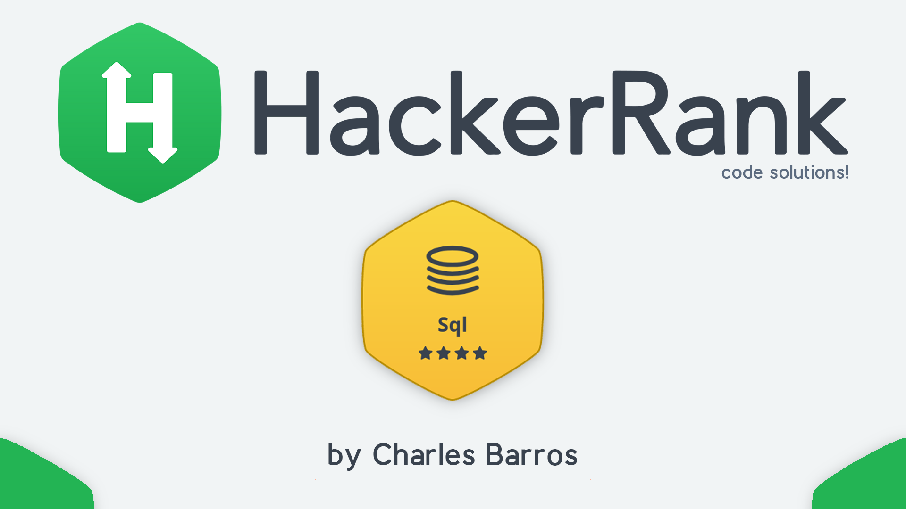

    

    

<h1 align='center'>SQL Challenges</h1>

    <h3>
      <a href='https://www.hackerrank.com/domains/sql?badge_type=sql' target="_blank"> HackerRank Platform</a>
    </h3>

## <strong>The Challenge</strong>
This is a series of 57 SQL Challenges, covering the main aspects of the SQL language such as Queries, Filters, Functions, Aggregations, etc.

## <strong>Important</strong>

The database is made available by the platform itself, that is, we do not have access to the DataBank to download, only for queries, however, all the information necessary to interpret and resolve the challenges are provided in the statement. For my resolutions, I used SQL commands based on DBMS MySQL.

## <strong>Solutions</strong>
> To see my solutions, check out the file [**<queries.ipynb>**](./queries.ipynb)

- [001 - Revising the Select Query I](https://www.hackerrank.com/challenges/revising-the-select-query/problem?isFullScreen=true)
- [002 - Revising the Select Query II](https://www.hackerrank.com/challenges/revising-the-select-query-2/problem?isFullScreen=true)
- [003 - Select All](https://www.hackerrank.com/challenges/select-all-sql/problem?isFullScreen=true)
- [004 - Select By ID](https://www.hackerrank.com/challenges/select-by-id/problem?isFullScreen=true)
- ...

- The rest of the challenges are still under development ... 

## <strong>Acknowledgments</strong>
I would like to thank the entire [HackerRank](https://www.hackerrank.com/) platform team for the excellent content made available.

